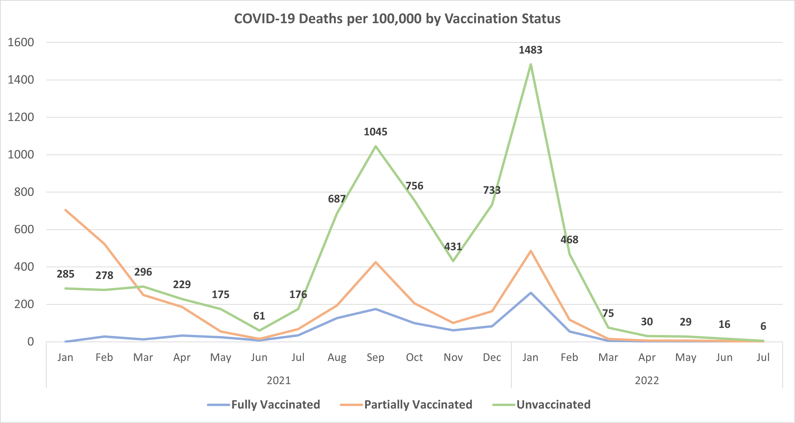
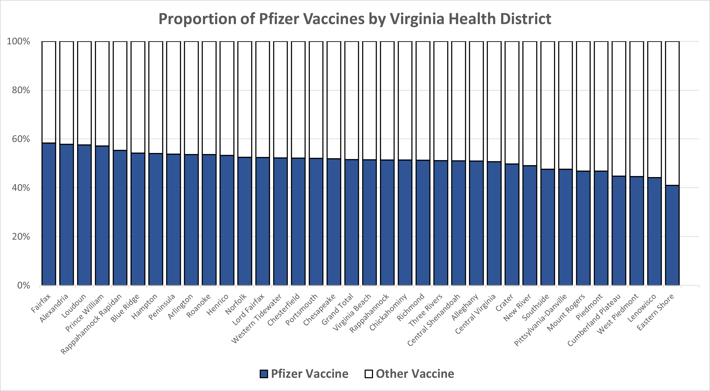
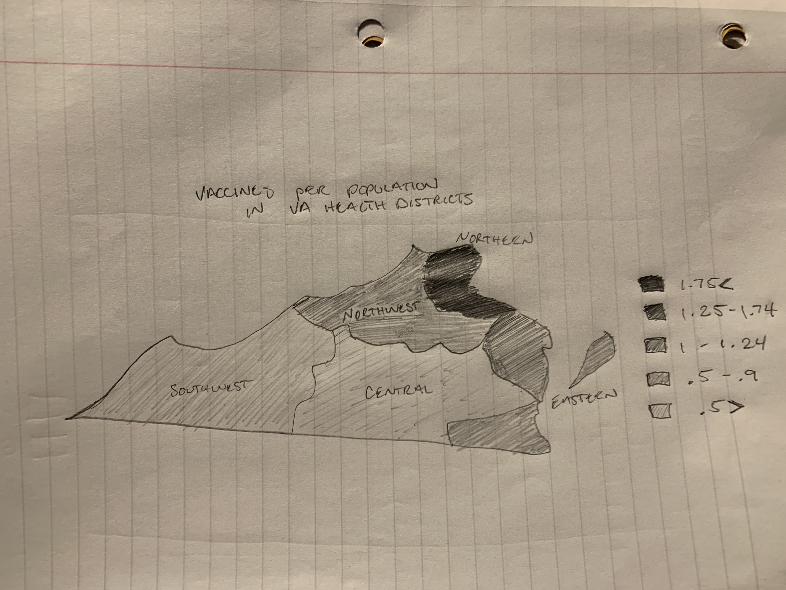
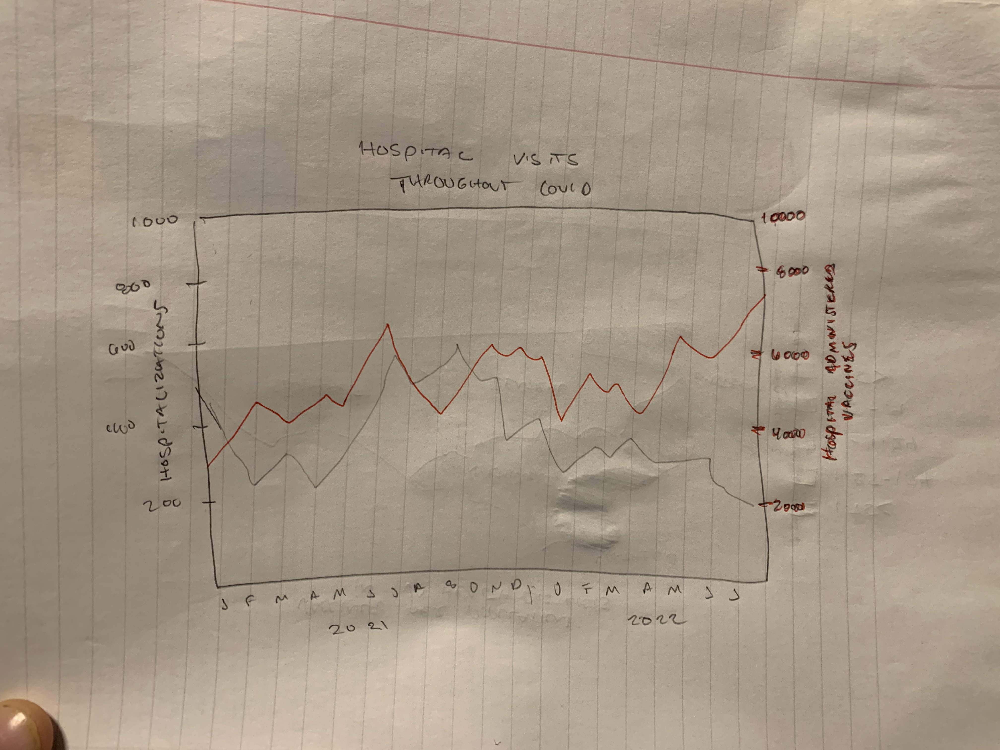

```{r setup, include=FALSE}
knitr::opts_chunk$set(echo = TRUE)
library(rmarkdown)
```

# Report

## Part 1

Ask: Use dataset 1 to create a chart to answer the question, "How has the weekly rate of COVID-19 cases in Virginia changed over time based on vaccination status?".

Dataset 1: https://data.virginia.gov/dataset/VDH-COVID-19-PublicUseDataset-Cases-by-Vaccination/vsrk-d6hx




The original dataset included 8 columns, report date, week ending date, health region, vaccination status, infections, hospitalizations, deaths, and population denominator. I selected deaths as my metric to compare over time and started by adding a new column. Because the population varies so widely across the regions, we need to normalize the data for this new column. I did that by taking the deaths, column g, divided by population denominator, column h, and then multiplied by 100,000 to create column i, deaths per 100,000. I then took the important data to answer this question, week ending date, vaccination status, and my new column into a new sheet entitled 'my data'.


Because there are multiple dates for each vaccination status driven by region breakout, the easiest way to examine data with multiple variables (dates and vax status) is to put the data into a pivot table. I added vaccine into columns, years into rows, and sum of deaths into values fields, which are ordinal, categorical, and quantitative attributes respectively. Knowing I had an ordinal attribute and a small amount of categorical attributes (vax status), a line chart would express the data over time in a clean, not cluttered way. There were around 70 unique weeks in the dataset which is a lot of variables to have on the x axis. The pivot table automatically consolidated to months instead of individual weeks. This is actually preferable because the week labels wouldn't be discernable on the x axis. 

Once the data was in a pivot table, I was able to insert a chart with the data which showed sum of deaths by vaccination status in each month throughout the dataset. I then went to work on formatting. I started with selecting unique colors for each category of vax status so there was discriminability between the three. I then enlarged the axis labels to a readable size which were both input automatically from the data. I added a legend at the bottom so it didn't compress the chart and brought that to a readable size as well. I added a chart title which was critical for this chart. Every chart needs to be adequately labeled, emphasis on the word adequately. If you're able to express more information in the title to where you don't need extra verbiage, it should be done. With my title 'Covid-19 deaths per 100,000 by Vaccination Status', I was able to eliminate the need for having a y axis title because it's already stated what we're measuring. The x axis time bound variable doesn't require explanation. 

In the chart, I make use of lines to display the data points while utilizing horizontal and vertical position to show the place in time and indicate the corresponding deaths to that date. I also use color to distinguish three categorical variables: fully vaccinated, partially vaccinated, and unvaccinated.

The last piece that gave me some trouble was data labels. The chart seemed to be missing something so I tried adding data labels to each series, but no matter what placement I gave them, they seemed to overlap at really critical points which was difficult to read. I decided to add data labels just to the unvaccinated series which not only is the largest value series and gives frame of reference to the others, it draws attention to vax status which is the true message of this chart; correlating vax status with deaths. 

When saving the chart I ran into an interesting problem. I removed the data labels from the full and partial vax status series, but when I saved the chart, it added the labels back. This turns out to be a known issue driven by pivot table caches. The workaround I used was to copy the values of the pivot table and paste into a new sheet and actually recreate the chart. I read about the problem at this reference. 

Reference 1: https://peltiertech.com/pivot-chart-formatting-changes/


## Part 2

Ask: Use dataset 2 to create a chart to answer the question, "For each health district in Virginia, what proportion of all 1st doses were of the Pfizer vaccine?".

Dataset 2: https://data.virginia.gov/dataset/VDH-COVID-19-PublicUseDataset-Vaccines-DosesAdmini/28k2-x2rj



The original dataset included information on vaccines administered throughout Virginia including administration date, FIPS, locality, health district, facility type, vaccine manufacturer, dose number, and the amount of doses administered. I accidentally download a variation of the file that had all of that information compressed into one column broken up by a semicolon. To remedy this, I used the text to columns function with ; delimiter to break up the data into 8 separate columns. 

Once I had separated data, I used the data filter to remove out of state or not reported health districts per the instructions. I then narrowed further with a data filter for dosage and selected only dose 1 because we want the proportion within the first dose. While working through the data I noticed Pfizer and Moderna vaccine manufacturerers were broken up into multiple vaccines seemlingly by age. I chose to consolidate each into one manufacturer because it's still the same company making it regardless of what age range it's for. This narrowed down manufacturers to 5 and 1 non specified.

I then put the data into a pivot table and copied the information after learning from my mistake on part 1. I inserted a new column called Pfizer Vaccine as a calculated field and derived the value for each cell by dividing the sum of Pfizer doses administered by health region by the grand total for that region. This expresses Pfizer vaccines as a percentage of the total doses administered. I then created another column called Other Vaccine that represented the complement of the new Pfizer column, or 1 minus the Pfizer proportion.

I generally like creating pie charts for proportions and historically am extremely against stacked bar charts, but in order to show the amount of health districts listed in one graph, having stacked bars was a choice much more conscious of doing more with less. The stacked bar chart expresses, from highest to lowest, the proportion of Pfizer vaccines in blue against the other in white. I chose white for the other because it looks like it could be a progress bar which is similar to a proportion. This chart makes uses of bars to express the data points, vertical and horizontal position to indicate percentage and which health district, and color by contrasting the Pfizer to everything else. It expresses one categorical variable with one ordinal variable. 

Further, I manipulated the text size of both axes to ensure readability, added a simple two category legend to express the manufacturer, and a chart title that clearly articulates what is being looked at. We are learning some fantastic tools in this class and unique ways of expressing data, but I routinely find that the most important thing is creating a chart so anyone can read it. Understanding a chart's limits in terms of data as well as the cognitive load looking at a visualization does to your mind should prompt all vis designers to stay simple. 

## Part 3

Ask: Propose two questions that require data from dataset 1 and dataset 2 to be combined to answer. Describe what data manipulation would need to be done to answer each question. Sketch a chart that could be used the answer each question. Justify your visualization idiom choice.

Question 1: What is the number of vaccine doses to health region population?
I would do this by converting each health district in the second dataset into it's respective region given the map provided. Then from there, I would sum the vaccine doses and population denominator by health region. I would then create a new calculated column of summed vaccine count divided by population denominator. To display this value in a unique way, I would create a heatmap of the Virginia health districts and shade in by value. 

This metric would likely resemble a population heatmap, but may pose some interesting outliers just in how the districts are arranged. This way of displaying the data would be appropriate because the number range. There likely would be a very small range of outcomes, perhaps 0-3?Because of the lack of size and scale of those numbers, we need something that will portray that in a way that's meaningful. Seeing 5 districts with a numbered value wouldn't mean much. The map of VA would also emphasize one of the key variables we're understanding and that's geographic area.

The map I sketched below shows using area marks and color (I shaded here but implying color) as well as location channel via a map. This map would indicate the amount of vaccine doses per population and I used an estimated result with my knowledge of Virginia. 



Question 2: What is the number of hospital administered vaccines compared to the number of hospitalizations over the given time frame?

For the first data set, I would sum hospitalizations by date. For the second data set I would I would sort the facility type to hospitals and sum vaccine doses administered by date. I would then chart the date along with hospitalizations number against the hospital vaccine doses (signifying a hospital visit) in a line chart format over time to display the strain on hospitals. 

Any time we have a few categorical variables plotted over time, line charts tend to win at display data effectively. Given the sum of hospitalizations and sum of hospital administered vaccines likely have large differences in count, I would plot each on it's own axis. While these aren't directly comparable metrics and don't mean a lot in the context of one another, it emphasizes how much time we're spending in hospitals over the time frame and will easily notice spikes in hospital usage in the line chart format. 

This chart makes uses of lines to display data points, vertical and horizontal position denoting the month and metric, as well as color to easily differentiate which line. The idea for this chart wasn't that the metrics calculated were comparable, but mostly to show hospital usage over time for the varying reasons, hospitalization for sickness or hospital visit to receive the vaccine. 



